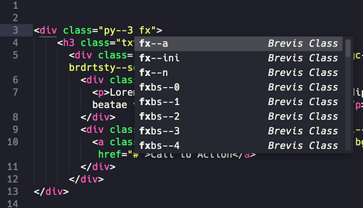

Brevis CSS Autocomplete
=============

Sublime Text 3/4 autocomplete plugin for Brevis CSS toolkit.

### Brevis

Brevis is a CSS toolkit designed for robust, high performance and scalable web applications.

* Homepage: [https://dlzi.github.io/brevis/](https://dlzi.github.io/brevis/)

### Installation

The plugin can be installed through Sublime Text's Package Control. Just search for [Brevis autocomplete](https://sublime.wbond.net/packages/Brevis%20autocomplete).

Alternatively, you can clone this repository to the Packages directory of your Sublime installation. On macOS, this looks as follows:

```bash
cd ~/Library/Application Support/Sublime Text 3/Packages/
git clone https://github.com/dlzi/brevis-autocomplete.git
```

### Usage

**Class name autocompletion**: When inside double quotes of a class attribute (`class="[HERE]"`), suggestions will appear for all Brevis classes.



**Note**: In order for the suggestions to appear, your document needs to have the syntax set to `HTML` (or any child syntax like `HTML (PHP)`).

### Credit

Created based on [webchun](https://github.com/webchun) plugins.

### Copyright and license

©2020 Daniel Zilli - Code Licensed [MIT](LICENSE), Docs [CC BY 3.0](https://creativecommons.org/licenses/by/3.0/).
